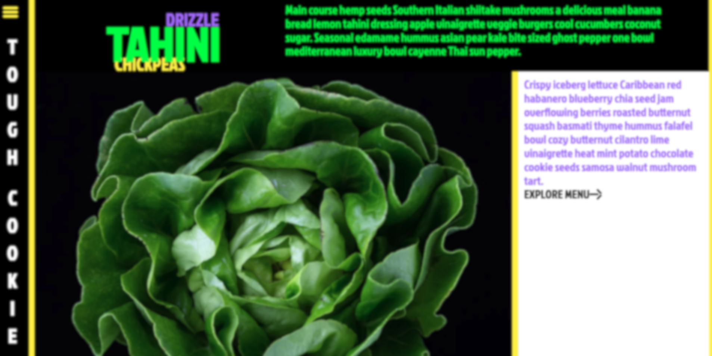

# Tough cookie

This project was developed as a school project at Medieinstitutet. 

We were given a pre-made design to replicate using HTML and CSS for the first time.

## Live published site

[Click here for live published version](https://mikaelakihl.github.io/mi-html-css-assignment2-toughcookie/)

**Language: English**

## Sneak peak

## Tech Stack

**HTML** | **SCSS** 

## Validation & a11y

### HTML

### CSS 

### Lighthouse Analyze

